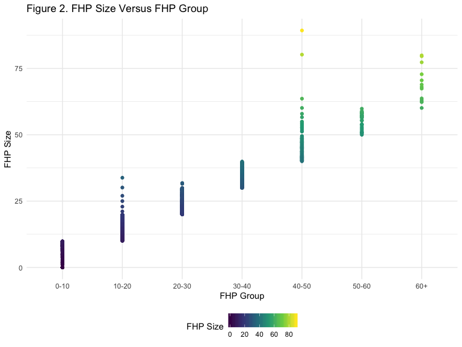

p8105 Midterm Project
================
Clement Mugenzi
10/17/2019

# Introduction

Smart device use in relation to the deformation of millenial’s skulls
have been a source of controversy for the last few years. Research
studies have been conducuted examining this very issue and some found
strong evidence connecting smart device use to an enlarged “hornlike”
spike at the back of the head, a formation mostly found in millenials.
This project uses data analysis concepts to expands on one of those
studies and uses data collected in order to refute or support
conclusions made in that study.

# Data Description

## Loading and tidying the dataset

``` r
hornlike_df = 
  read_excel("Data/p8105_mtp_data.xlsx", 
             range = "A9:I1230") %>% 
  janitor::clean_names() %>% 
# changing to appropriate variable names.
  rename(eop_group = "eop_size", eop_size = "eop_size_mm",
         fhp_size = "fhp_size_mm", fhp_group = "fhp_category",
         enlarged_eop = "eop_visibility_classification") %>%
# replacing missing values in the eop_size variable by 0.
# Creating character and ordered factors for categorical variables.
  mutate(
    eop_size = replace_na(eop_size, 0),
    sex = recode(sex, "0" = "Female", "1" = "Male"),
    age_group = recode(age_group, "1" = "0-18", "2" = "18-30", 
                       "3" = "31-40", "4" = "41-50",
                       "5" = "51-60", "6" = "60+",
                       "7" = "60+", "8" = "60+"),
    eop_group = recode(eop_group, "0" = "0-5", "1" = "5-10", 
                       "2" = "10-15", "3" = "15-20",
                        "4" = "20-25", "5" = "25+"),
    fhp_group = recode(fhp_group, "0" = "0-10", "1" = "10-20",
                       "2" = "20-30", "3" = "30-40", 
                       "4" = "40-50", "5" = "50-60",
                       "6" = "60+", "7" = "60+"),
    enlarged_eop = recode(enlarged_eop, "0" = "Absent",
                            "1" = "Visible", "2" = "Fully Developed"),
    sex = factor(sex, levels = c("Female", "Male")),
    enlarged_eop = factor(enlarged_eop, levels = c("Absent",
                                                       "Visible",
                                                       "Fully Developed")),
    eop_shape = factor(eop_shape, levels = c("0", "1", "2", "3")),
    age_group = factor(age_group, levels = c("0-18", "18-30",
                                             "31-40", "41-50",
                                             "51-60", "60+")),
    eop_group = factor(eop_group, levels = c("0-5", "5-10",
                                             "10-15", "15-20",
                                             "20-25", "25+")),
    fhp_group = factor(fhp_group, levels = c("0-10", "10-20",
                                             "20-30", "30-40",
                                             "40-50", "50-60",
                                             "60+"))) %>%
  arrange(sex) %>% 
  select(-eop_shape)
```

This dataset is comprised of **8** variables and **1221** observations
which is also the number representative of how many participants were
studied by the original scientific report. In brief, I started by
renaming relevant variables with appropriate names then used **mutate**
function to recode values and redefine **sex, eop\_visibility,
age\_group, eop\_group, and fhp\_group** variables by making them
factors.

## Age and Gender Distribution

``` r
age_gender = 
  hornlike_df %>% 
  group_by(sex, age_group) %>% 
# renaming age group here but this won't affect the main dataframe.
  rename("Age Group" = "age_group") %>% 
  summarise(
    frequency = n()) %>% 
  pivot_wider(
    names_from = sex,
    values_from = frequency) %>% 
  knitr::kable()
age_gender
```

| Age Group | Female | Male |
| :-------- | -----: | ---: |
| 0-18      |      1 |    1 |
| 18-30     |    151 |  152 |
| 31-40     |    102 |  102 |
| 41-50     |    106 |  101 |
| 51-60     |     99 |  101 |
| 60+       |    155 |  150 |

## Issues with the Dataset

### a. EOP Size and Group

``` r
hornlike_df %>% 
  ggplot(aes(x = eop_group, y = eop_size)) +
  geom_point(aes(color = eop_size)) +
  labs(
    title = "Figure 1. EOP Size Versus EOP Group",
    x = "EOP Group",
    y = "EOP Size")
```


I notice several issues in this figure. Here the categorical variable
**eop\_group** is misclassifying several continuous **eop\_size**
values. For instance, in the range **20-25**, the eop size seems to span
values ranging from 20 to about 35 mm. Also, there is a value with size
**15.0 mm** that was not classified in either **10-15** or **15-20**
ranges.

### b. FHP Size and Group

``` r
hornlike_df %>% 
  ggplot(aes(x = fhp_group, y = fhp_size)) +
  geom_point(aes(color = fhp_size)) +
  labs(
    title = "Figure 2. FHP Size Versus FHP Group",
    x = "FHP Group",
    y = "FHP Size")
```



The same pattern of misclassification is happening here as well where
FHP sizes are being classified in groups they should not be classified
in due to poor definitions of ranges on the part of the researcher. An
example here would be a **FHP size** of **30.3 mm** being considered as
a missing value instead of being classified in the **30-40** range.

# Visualization

## Fig.3 and Fig.4

``` r
fig_3 = 
  hornlike_df %>% 
  group_by(fhp_size, age_group, sex) %>%
  summarise(
    mean_tm = mean(fhp_size),
    sd_tm = sd(fhp_size)) %>% 
  ggplot(aes(x = age_group, y = mean_tm, fill = sex)) +
  geom_bar(stat = "identity", color = "black", position = position_dodge())


fig_4 = 
  hornlike_df %>% 
  group_by(enlarged_eop, age_group, sex) %>% 
  filter(enlarged_eop == "Fully Developed") %>% 
  summarise(eeop_count = n()) %>% 
  ggplot(aes(x = age_group, y = eeop_count, color = sex)) +
  geom_line(size = 2) + geom_point()

fig_3 + fig_4
```

    ## geom_path: Each group consists of only one observation. Do you need to
    ## adjust the group aesthetic?


## 2x5 Collection of Panels
